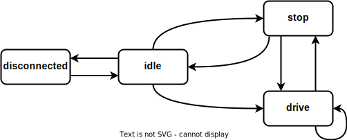

# Smurf Example App
C++ application showing possible usage of StateSmurf framework

### Requirements
- cmake [>= 3.20]
- C++20
- [cmlib](https://github.com/cmakelib/cmakelib)
- TransitionSmurf

### Build
```
mkdir -p _build && cd _build
cmake ../ -DCMAKE_BUILD_TYPE=Debug
make -j 8
```
### Run
```
./smurfExampleApp --speed <int>
```
#### Arguments
- **--speed**: target speed. Each increment take 1 second => is duration of run.

### Test
```
mkdir -p _build && cd _build
cmake ../ -DCMAKE_BUILD_TYPE=Debug -DBRINGAUTO_TESTS=ON
make -j 8
ctest
```

### State Diagram
State diagram on which SmurfExampleApp is working

