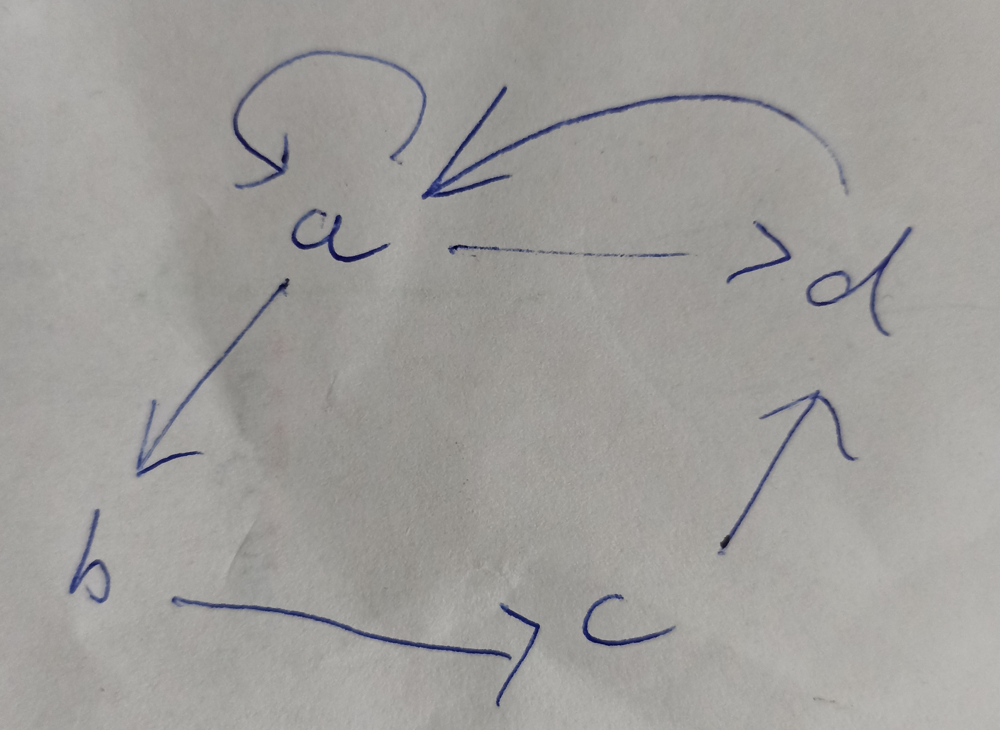

# TransitionSmurf
API for moving on DiagramSmurf and logging transitions. Logs are used for integration testing of applications.

State transition logs have `[TransitionSmurf]` prefix.
On initialization, State Transition Table is logged with `[DiagramSmurf]` prefix.

## Requirements

Following dependencies must be installed on the host system

- cmake [>= 3.21]
- C++20
- [cmlib](https://github.com/cmakelib/cmakelib)
- DiagramSmurf

## Build

```
mkdir -p _build && cd _build
cmake .. -DCMAKE_BUILD_TYPE=Release
make -j 8
```

## Tests
- For building tests use -DBRINGAUTO_TESTS=ON
- Start tests: `$ ./test/transition_smurf_tests`

## Usage
- TransitionSmurf library uses bringauto Logger library, that has to be inicialized before using.

Clone directory to your project and add as subdirectory in CMakeLists.txt:
  ```
  ADD_SUBDIRECTORY("<Path_to_TransitionSmurf_directory>")
  
  TARGET_LINK_LIBRARIES(<target> PUBLIC TransitionSmurfLib bringauto_logger::bringauto_logger)
  ```

### Logs format
On initialization, state transition table is logged in format:
```log
[YYYY-MM-DD hh:mm:ss.ms] [appName] [debug] [DiagramSmurf] <Origin Vertex> : <List of destination vertexes>
```

Example of State Transition Table for following state diagram:
```log
[2022-02-21 10:44:28.900] [virtual-vehicle-utility] [debug] [DiagramSmurf] __START__ :	A
[2022-02-21 10:44:28.900] [virtual-vehicle-utility] [debug] [DiagramSmurf] A :	A B D
[2022-02-21 10:44:28.900] [virtual-vehicle-utility] [debug] [DiagramSmurf] B :	C
[2022-02-21 10:44:28.900] [virtual-vehicle-utility] [debug] [DiagramSmurf] C :	D
[2022-02-21 10:44:28.900] [virtual-vehicle-utility] [debug] [DiagramSmurf] D :	A
```
Special vertex ____START__ __ indicates list of Starting Vertexes.



After state transition table, Start of run is logged:
```log
[YYYY-MM-DD hh:mm:ss.ms] [appName] [debug] [TransitionSmurf] Start of Run 
```

All other logs are state transition logs in format:
```log
[YYYY-MM-DD hh:mm:ss.ms] [appName] [debug] [TransitionSmurf] Going to state <state>
```

If a state transition wasn't successful Warning is logged:
```
[YYYY-MM-DD hh:mm:ss.ms] [appName] [warning] [TransitionSmurf] Couldn't change state { "to": <state> "from": <state> }
```


### Example
- Example can be found in `./example/main.cpp` or in `StateSmurf/SmurfExampleApp/`